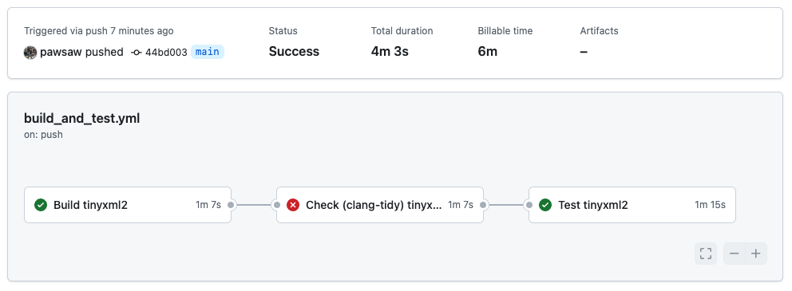

TinyXML-2 (Bazel build)
=======================

This project is a fork of the popular [TinyXML-2](https://github.com/leethomason/tinyxml2/) C++11 library, which has been ported from *CMake* and *Meson* to *[Bazel](https://bazel.build/)* in terms of the build system.

A Continues Integration (CI) solution based on *GitHub* and in particular *[GitHub Actions](https://github.com/features/actions)* is also presented here. This solution represents a minimal but useful system with the purpose of ensuring a high-quality code base and development process.

The actual C++ implementation has been retained in its entirety. Nothing has changed in terms of use from the user's perspective either. It corresponds to version v10.0.0 (as of March 22, 2024) of the original project.

For this reason, reference should be made here to the project description and documentation of the original project: [https://github.com/leethomason/tinyxml2/](https://github.com/leethomason/tinyxml2/)

The following description focuses on the Bazel-specific build and the CI specifics based on GitHub Actions.

# Changes in comparison to the original project

The changes that have been made compared to the original project relate exclusively to the build system and the documentation.

**Some files (and directories) have been removed. This is purely for the sake of clarity, as these removals could just as easily be retained.**

## Removed files and directories (clarity)

- `.github/workflows/test.yml`
- `cmake/**`
- `contrib/**`
- `docs/**`
- `CMakeLists.txt`
- `Makefile`
- `TinyXML2_small.png`
- `dox`
- `meson.build`
- `meson_options.txt`
- `readme.md`
- `setversion.py`

## Added files and directories

- `.github/workflows/build_and_test.yml`
- `build_platforms/**`
- `build_settings/**`
- `resources/BUILD.bazel`
- `.bazelrc`
- `.clang-tidy`
- `BUILD.bazel`
- `Dockerfile`
- `MODULE.bazel`
- `MODULE.bazel.lock`
- `README.md`
- `WORKSPACE.bazel`

## Moved files

- `tinyxml2.cpp` ➔ `src/tinyxml2.cpp`
- `tinyxml2.h` ➔ `src/tinyxml2.h`
- `xmltest.cpp` ➔ `src/xmltest.cpp`

# Build environment

This project supports a build environment with vanilla Bazel or a containerized solution with Docker.

## Vanilla Bazel on Linux, Mac OS and Windows

### Tested Operating Systems, Compilers and C++ Standard Library implementations

The build has been successfully tested on the following systems:

| OS                     | Architecture | Bazel     | Compiler                  | C++ std library        |
| ---------------------- | ------------ | --------- | ------------------------- | ---------------------- |
| Ubuntu 22.04 LTS       | x86_64       | 7.1.0 LTS | clang 10.0.0<br>g++ 9.4.0 | libc++10<br>libstdc++6 |
| Mac OS (Sonoma 14.2.1) | x86_64       | 7.1.0 LTS | Apple clang 15.0.0        | libc++15               |

Optionaly: An installation of `clang-tidy` is recommended. 

Other configurations can work (probably upwards), but do not have to.

**The build on Windows is to be considered experimental.**

### The Build with Bazel

A distinction is made between three types of build: 

**build:**\
Builds the tinyxml2 library

**test:**\
Tests the library tinyxml2 using several sample XML files as provided in the `resources` directory.

**clang-tidy:**\
Executes `clang-tidy` according to the rules as specified in the `.clang-tidy` file and presents a report on stdout.\
An installation of `clang-tidy`is required.\
***Attention:*** The current status of the code generates an error report here. It should be the aim of the developers to fulfill the rules defined here in the future.


| OS                     | Kind                 | Command                                                        |
| ---------------------- | -------------------- | -------------------------------------------------------------- |
| Ubuntu 22.04 LTS       | build                | `bazel build //:tinyxml2 --config=linux`                     |
| Ubuntu 22.04 LTS       | test                 | `bazel test //:xmltest --config=linux`                       |
| Ubuntu 22.04 LTS       | clang-tidy (failing) | `bazel build //:tinyxml2 --config=clang-tidy --config=linux` |
| Mac OS (Sonoma 14.2.1) | build                | `bazel build //:tinyxml2 --config=mac`                       |
| Mac OS (Sonoma 14.2.1) | test                 | `bazel test //:xmltest --config=mac`                         |
| Mac OS (Sonoma 14.2.1) | clang-tidy (failing) | `bazel build //:tinyxml2 --config=clang-tidy --config=mac`   |

The experimental support on windows is enabled by the `--config=windows` option.

The respective options `--config=linux`, `--config=mac` and `--config=windows` select the default Compiler and C++ Standard Library implementations.

However, it is possible to select a different Compiler or C++ Standard Library implementation on the respective operating system, **if installed**:

| Compiler | C++ Standard Library | Option            |
| -------- | -------------------- | ----------------- |
| clang    | \-                   | `--config=clang`  |
| g++      | \-                   | `--config=gcc`    |
| \-       | libc++               | `--config=stdlib` |
| \-       | libstdc++            | `--config=stdcpp` |


The *debug* and *release* flavors are also supported.

| Flavor  | Activated Compiler Flags | Additions                                                                           | Bazel Option       |
| ------- | ------------------------ | ----------------------------------------------------------------------------------- | ------------------ |
| debug   | \-g -O0                  | Activates additional TINYXML2_DEBUG Preprocessor flag for additonal debug messages. | `--config=debug`   |
| release | \-O2                     | \-                                                                                  | `--config=release` |                    |

Full example:
```sh
bazel build //:tinyxml2 --config=linux --config=clang --config=stdlib --config=release
```

## Dockerized Build

To harmonize the setup of the toolchain between the developers and simplify it on the respective developer machine, the use of Docker is recommended.

The Docker image described here is also used for the CI environment (with GitHub Actions).

### Docker Image

| Kind         | Value       | supports             |
| ------------ | ----------- | -------------------- |
| OS           | Linux       |                      |
| Architecture | x86_64      |                      |
| Bazel        | 7.1.0 (LTS) |                      |
| clang        | 10.0.0      | `--config=clang`     |
| g++          | 9.4.2       | `--config=gcc`       |
| libc++       | libc++10    | `--config=stdlib`    |
| libstdc++    | libstdc++6  | `--config=stdcpp`    |
| clang-tidy   | 10.0.0      | `--config=clang-tidy`|

### Installation

In the project directory:
```sh
docker build -t tinyxml2-bazel .
```

### Usage

Create a cache directory for bazel (on your machine, the host):
```sh
mkdir -p /tmp/build_output
```
Note: It's recommended to use exactly this directory.


Run bazel commands:
```sh
docker run --rm -v $(pwd):/workspace -v /tmp/build_output:/tmp/build_output tinyxml2-bazel --output_user_root=/tmp/build_output build //:tinyxml2
```

You may want to replace `build //:tinyxml2` with one of the desired options as described.

### Simplified usage

You may want to create an alias in your `.bashrc` or `.zshrc`
```sh
alias tinyxml-bazel="mkdir -p /tmp/build_output && docker run --rm -v $(pwd):/workspace -v /tmp/build_output:/tmp/build_output tinyxml2-bazel --output_user_root=/tmp/build_output"
```

| Kind                 | Command                                                 |
| -------------------- | ------------------------------------------------------- |
| build                | `tinyxml-bazel build //:tinyxml2`                       |
| test                 | `tinyxml-bazel test //:xmltest`                         |
| clang-tidy (failing) | `tinyxml-bazel build //:tinyxml2 --config=clang-tidy`   |

Feel free to use additional `--config=...` options:

| Compiler | C++ Standard Library | Option            |
| -------- | -------------------- | ----------------- |
| clang    | \-                   | `--config=clang`  |
| g++      | \-                   | `--config=gcc`    |
| \-       | libc++               | `--config=stdlib` |
| \-       | libstdc++            | `--config=stdcpp` |

The *debug* and *release* flavors are also supported:

| Flavor  | Bazel Option       |
| ------- | ------------------ |
| debug   | `--config=debug`   |
| release | `--config=release` |   

# CI with GitHub and GitHub Actions


## Git branching concept

The following GitHub workflow is configured for this project.

Branches:
| Branch                | Description                                                                                       | 
| --------------------- | ------------------------------------------------------------------------------------------------- |
| `main`                | release branch                                                                                    |
| `develop`             | the current development branch. The developer makes a pull-request `develop` ➔ `main` at release  |
| `feat/<feature-name>` | branched off from develop. The developer makes a pull-request `feat/<feature-name>` ➔ `develop`   |

**The direct merge or rebase to `main` and `develop` is prohibited.**

The merge of a pull request is only possible if the ***Build and Test tinyxml2 GitHub Workflow*** runs successfully.

## Build and Test tinyxml2 GitHub Workflow

With every pull-request on `main` or `develop`, the *Build and Test tinyxml2 GitHub Actions workflow* is triggered.

This consists of three consecutive jobs, which are described below:

| name                        | description                                                                                       | required to succeed | depends on                  |
| --------------------------- | ------------------------------------------------------------------------------------------------- | ------------------- | --------------------------- |
| Build tinyxml2              | Builds the tinyxml2 library                                                                       | yes                 | \-                          |
| Check (clang-tidy) tinyxml2 | Runs clang-tidy, finds code smells and checks the style                                           | no                  | Build tinyxml2              |
| Test tinyxml2               | Tests the library tinyxml2 using several sample XML files as provided in the resources directory. | yes                 | Check (clang-tidy) tinyxml2 |

The graphic below shows a successful workflow.

